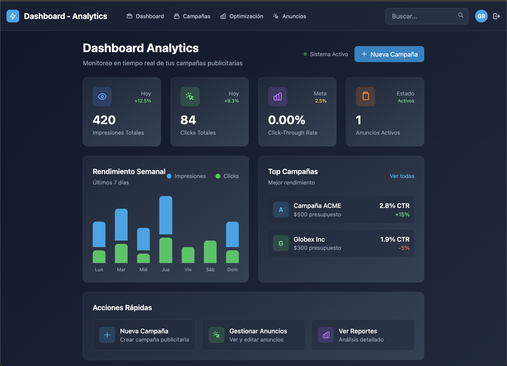

# Real-Time Advertising System

This application is a comprehensive implementation of a modern advertising system, designed to understand and demonstrate the intricacies of the digital advertising world. It consists of a network of microservices, each with specific purposes within the ecosystem.



## 🚀 Key Features

- **Real-Time Bidding (RTB)**: High-performance auction engine for ad placement
- **Campaign Management**: Complete interface for creating and managing ad campaigns
- **Real-Time Dashboard**: Live metrics and performance monitoring with WebSocket updates
- **Microservices Architecture**: Scalable and maintainable service separation

## 🏗️ System Components

- **Ad Server**: Handles ad delivery and tracking
- **Auction Engine**: Manages real-time bidding process
- **Campaign Manager**: Handles campaign creation and management
- **Analytics Service**: Processes impressions and clicks
- **Real-Time Dashboard**: Provides live system metrics

## 🛠️ Technology Stack

- **Backend**: Go (Golang)
- **Database**: PostgreSQL
- **Caching**: Redis
- **Containerization**: Docker
- **Frontend**: HTMX + Tailwind CSS
- **Real-Time**: WebSocket for live updates

## 📚 Documentation

For detailed information, please check:
- [Quick Start Guide](docs/QUICK-START.md)
- [Testing Documentation](docs/README-TESTING.md)
- [Real-Time Dashboard](docs/REALTIME-DASHBOARD.md)
- [UI Improvements](docs/UI-IMPROVEMENTS.md)

## 🚀 Getting Started

```bash
# Clone the repository
git clone [repository-url]

# Start all services
docker-compose up -d

# Run migrations
make migrate

# Load test data
make seed

# Access the dashboard
open http://localhost:8081/dashboard
```

## 📊 Monitoring

The system includes comprehensive monitoring capabilities:
- Real-time metrics dashboard
- Performance monitoring
- Click-through rate (CTR) tracking
- Campaign performance analytics

## 🤝 Contributing

Contributions are welcome! Please read our contributing guidelines before submitting pull requests.

## 📝 License

This project is licensed under the MIT License - see the LICENSE file for details.